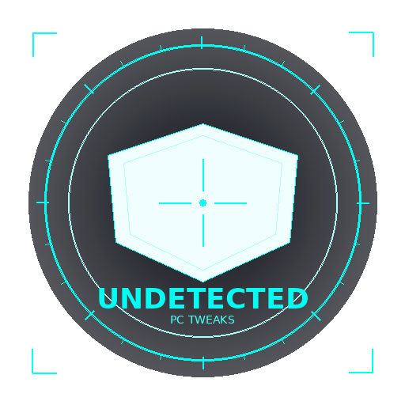

# ⟐ UNDETECTED — PC Tweaks

<p align="center">
  
</p>

<p align="center">
  <strong>A modern HUD-style PC optimization & tweaking tool</strong><br>
  <em>Community: Undetected</em>
</p>

---

## Features

### 🔐 KeyAuth Authentication
- Login / Register / License key activation
- HWID-locked sessions
- Subscription management

### ⚡ Advanced PC Tweaks (35+ tweaks)

| Category | Tweaks |
|----------|--------|
| **⚡ Performance** | Svchost split, Prefetch/Superfetch, HPET timer, process scheduling, NTFS optimization, system cache |
| **🌐 Network** | TCP stack optimization, Nagle algorithm, DNS (Cloudflare/Google), network throttling, Wi-Fi Sense |
| **🎮 Gaming** | Game Mode, GPU scheduling, fullscreen optimizations, Game DVR, GPU preference, multimedia priority |
| **🔒 Privacy** | Telemetry, activity history, advertising ID, location tracking, Cortana, feedback |
| **🔋 Power** | Ultimate Performance plan, hibernation, USB suspend, fast startup |
| **🧹 Cleanup** | Temp files, DNS cache, Windows Update cache, event logs |
| **🎨 Visuals** | UI animations, transparency, visual effects, dark mode |
| **💾 Memory** | Pagefile encryption, memory compression, svchost memory |

### 🖥️ HUD-Style Interface
- Dark theme with cyan neon accents
- Animated sidebar navigation
- Risk-level badges (LOW / MEDIUM / HIGH) for each tweak
- Real-time status bar
- Toggle switches with instant apply/revert
- Custom-designed logo and branding

## Screenshots

The application features a modern HUD-style interface with:
- Left sidebar for category navigation
- Main panel with scrollable tweak cards
- Each tweak has a toggle switch, risk badge, and description
- Top bar with branding and user info
- Bottom status bar with active tweak count

## Requirements

- **OS:** Windows 10/11
- **Python:** 3.10+
- **Admin Rights:** Required for system-level tweaks

## Installation

### From Source

```bash
# Clone the repo
git clone https://github.com/your-username/undetected-pc-tweaks.git
cd undetected-pc-tweaks

# Install dependencies
pip install -r requirements.txt

# Generate assets (logo, icon)
python generate_logo.py

# Run the app
python app.py
```

### Build Standalone .exe

```bash
pip install pyinstaller
python build.py
# Output: dist/Undetected.exe
```

## Configuration

Set your KeyAuth credentials as environment variables before running:

```bash
set KEYAUTH_APP_NAME=YourAppName
set KEYAUTH_APP_SECRET=YourAppSecret
set KEYAUTH_APP_VERSION=1.0
set KEYAUTH_OWNER_ID=YourOwnerID
```

Or create a `.env` file (never commit this):

```
KEYAUTH_APP_NAME=YourAppName
KEYAUTH_APP_SECRET=YourAppSecret
KEYAUTH_APP_VERSION=1.0
KEYAUTH_OWNER_ID=YourOwnerID
```

## How Tweaks Work

Each tweak consists of:
- **Apply command:** Registry edit or system command to enable the optimization
- **Revert command:** Restores the original Windows default
- **Risk level:** LOW (safe), MEDIUM (may affect some apps), HIGH (advanced users only)

Tweak states are persisted to `~/.undetected_tweaks_state.json` so the app remembers what you've applied across sessions.

## Project Structure

```
undetected-pc-tweaks/
├── app.py              # Main application (HUD UI)
├── keyauth_api.py      # KeyAuth API wrapper
├── tweaks.py           # All tweak definitions & execution
├── generate_logo.py    # Logo/icon generator
├── build.py            # PyInstaller build script
├── requirements.txt    # Python dependencies
├── pyproject.toml      # Project metadata
├── assets/
│   ├── logo.png        # 512x512 logo
│   ├── icon.png        # 256x256 icon
│   └── icon.ico        # Windows icon
└── README.md
```

## Community

**Undetected** — Built for performance enthusiasts who want full control over their system.

## License

MIT License — See [LICENSE](LICENSE) for details.

## ⚠️ Disclaimer

This tool modifies Windows registry settings and system configurations. While all tweaks include revert functionality, use at your own risk. Always create a system restore point before applying tweaks. Run as Administrator for full functionality.
